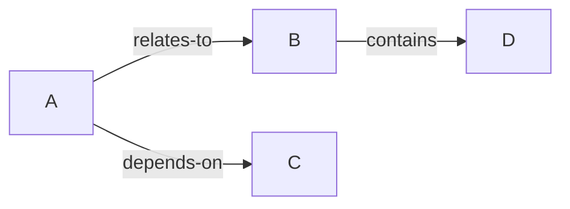

# Entity Maps Instructions

## Overview

Entity Maps help visualize relationships between concepts, components, and ideas in your project. Use them for architecture planning, knowledge organization, and team alignment.

## Skills

### Entity Maps Creator

Generates entity relationship maps in markdown with Mermaid diagrams.

**Run:**
```bash
python ~/.agents/skills/entity-maps/scripts/create_map.py "Map Name"
```

**Features:**
- Auto-generates markdown with entities and relationships
- Creates Mermaid graph diagrams
- Supports tags and attributes
- JSON export available

## Usage

### Create New Map

```bash
# In your project directory
python ~/.agents/skills/entity-maps/scripts/create_map.py "Architecture Map"
```

This creates: `architecture-map-entity-map.md`

### Manual Creation

Create a file with this structure:

```markdown
# Entity Map: [Name]

## Entities
- **Entity A**: Description `[tag1, tag2]`
- **Entity B**: Description `[tag3]`

## Relationships
- Entity A → [relates-to] → Entity B
- Entity A → [depends-on] → Entity C
- Entity B → [contains] → Entity D

## Graph

```

## Relationship Types

| Type | Description |
|------|-------------|
| relates-to | General association |
| depends-on | Dependency relationship |
| contains | Hierarchical structure |
| implements | Interface realization |
| extends | Inheritance/extension |
| uses | Usage relationship |

## Integration with OKF

Add entity maps to your OKF template:

```markdown
## Architecture

See [Entity Map](./architecture-entity-map.md) for detailed relationships.
```

## Files Location

```
~/.agents/skills/entity-maps/
├── SKILL.md              # Skill definition
├── scripts/
│   └── create_map.py     # Map creator
```

## Tips

1. Start with core entities before adding details
2. Use consistent relationship types
3. Keep diagrams simple and focused
4. Update maps as project evolves
5. Reference maps from OKF.md
