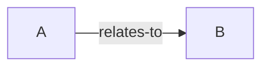

# Entity Maps

## Overview

Entity Maps visualize relationships between concepts, components, and ideas. Break complex topics into entities and map their connections.

**Documentation:**
- [Instructions](./entity-maps-instructions.md) - How to use
- [EntityMap Platform](https://entitymap.org) - External tool

## Quick Start

```bash
# Create new entity map
python ~/.agents/skills/entity-maps/scripts/create_map.py "My Map"
```

## Structure

```markdown
## Entities
- **Entity A**: Description `[tags]`

## Relationships
- Entity A → [relates-to] → Entity B

## Graph

```

## Relationship Types

- `relates-to` - General association
- `depends-on` - Dependency
- `contains` - Hierarchy
- `implements` - Interface
- `extends` - Inheritance
- `uses` - Usage

## Integration

Reference entity maps from your OKF template:

```markdown
## Architecture
See [Entity Map](./architecture-entity-map.md) for relationships.
```

---

See [entity-maps-instructions.md](./entity-maps-instructions.md) for detailed usage.