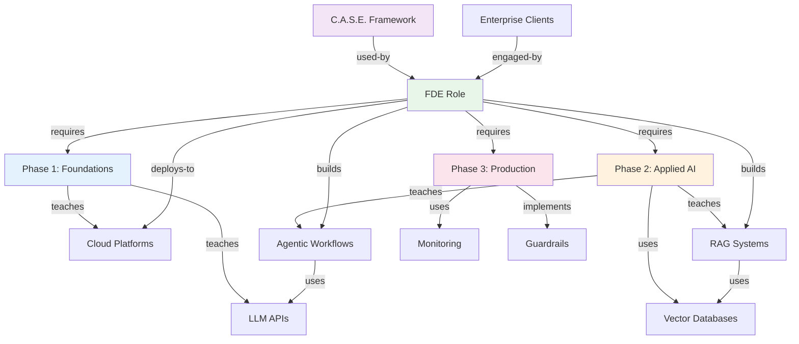

# Entity Map: FDE AI Engineer Roadmap

## Entities

- **FDE Role**: Forward Deployed Engineer - hybrid dev/ML/client role `[role, career]`
- **Phase 1**: Core AI & Enterprise Foundations (Days 1-30) `[phase, learning]`
- **Phase 2**: Applied AI Fluency & Agent Workflows (Days 31-60) `[phase, learning]`
- **Phase 3**: Production & Stakeholder Management (Days 61-90) `[phase, learning]`
- **LLM APIs**: OpenAI, Anthropic, Hugging Face `[tools, ai]`
- **Cloud Platforms**: AWS, GCP, Azure `[infrastructure, cloud]`
- **Vector Databases**: Pinecone, Milvus, Weaviate, ChromaDB `[tools, data]`
- **RAG Systems**: Retrieval-Augmented Generation `[technique, ai]`
- **Agentic Workflows**: Multi-agent orchestration `[technique, ai]`
- **Monitoring**: TensorBoard, MLflow `[tools, ops]`
- **Guardrails**: Safety features for AI `[technique, safety]`
- **C.A.S.E. Framework**: Interview diagnostic approach `[framework, interview]`
- **Enterprise Clients**: Hospitals, banks, large orgs `[stakeholder]`

## Relationships

- FDE Role → [requires] → Phase 1
- FDE Role → [requires] → Phase 2
- FDE Role → [requires] → Phase 3
- Phase 1 → [teaches] → LLM APIs
- Phase 1 → [teaches] → Cloud Platforms
- Phase 2 → [teaches] → RAG Systems
- Phase 2 → [uses] → Vector Databases
- Phase 2 → [teaches] → Agentic Workflows
- Phase 3 → [uses] → Monitoring
- Phase 3 → [implements] → Guardrails
- RAG Systems → [uses] → Vector Databases
- Agentic Workflows → [uses] → LLM APIs
- C.A.S.E. Framework → [used-by] → FDE Role
- Enterprise Clients → [engaged-by] → FDE Role
- FDE Role → [deploys-to] → Cloud Platforms
- FDE Role → [builds] → RAG Systems
- FDE Role → [builds] → Agentic Workflows

## Graph



## Learning Path

```
Phase 1 (Days 1-30)          Phase 2 (Days 31-60)         Phase 3 (Days 61-90)
├─ LLM APIs                  ├─ RAG Systems               ├─ Monitoring
├─ Cloud/Security            ├─ Vector Databases           ├─ Guardrails
└─ System Design             └─ Agentic Workflows          └─ Consulting
```

## Skill Dependencies

| Skill | Prerequisites | Leads To |
|-------|---------------|----------|
| LLM APIs | Python basics | RAG, Agents |
| Cloud Platforms | IT fundamentals | Deployment |
| Vector Databases | SQL, data modeling | RAG Systems |
| RAG Systems | LLM APIs, VDBs | Production AI |
| Agentic Workflows | RAG, LLM APIs | Enterprise AI |
| Monitoring | All above | Production ops |

## Case Study: Hospital Readmission

```
Discovery (Days 1-7) → Secure Landing Zone (Days 8-15) → Agentic Pipeline (Days 16-25) → Value Validation (Days 26-30)
     ↓                        ↓                              ↓                              ↓
Data profiling           GCP Landing Zone              Vertex AI Search              AutoSxS evaluation
Stakeholder trust        VPC + DLP masking             Cloud Run service             Doctor UAT dashboard
```

---

See [OKF.md](./FDE-AI-Engineer-Roadmap-OKF.md) for objectives and key results.
